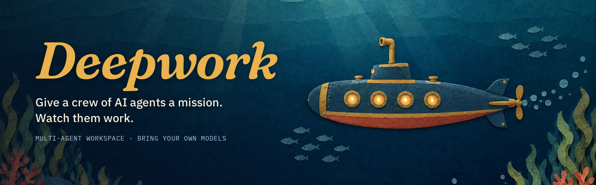
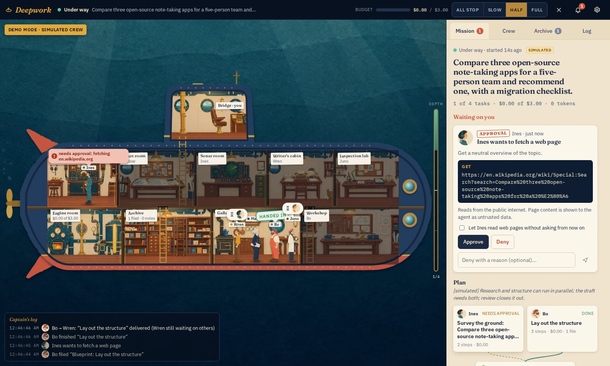
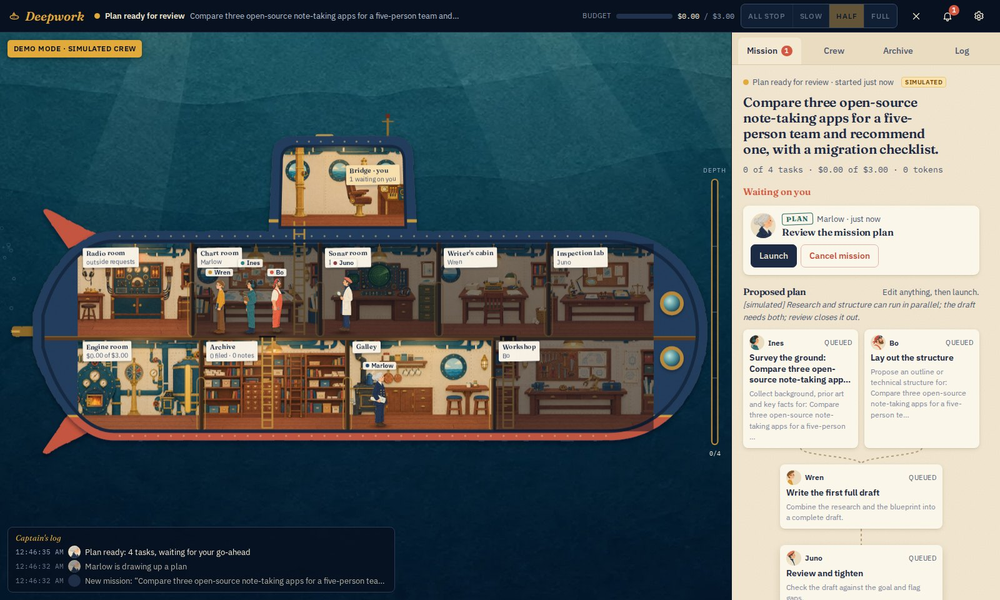
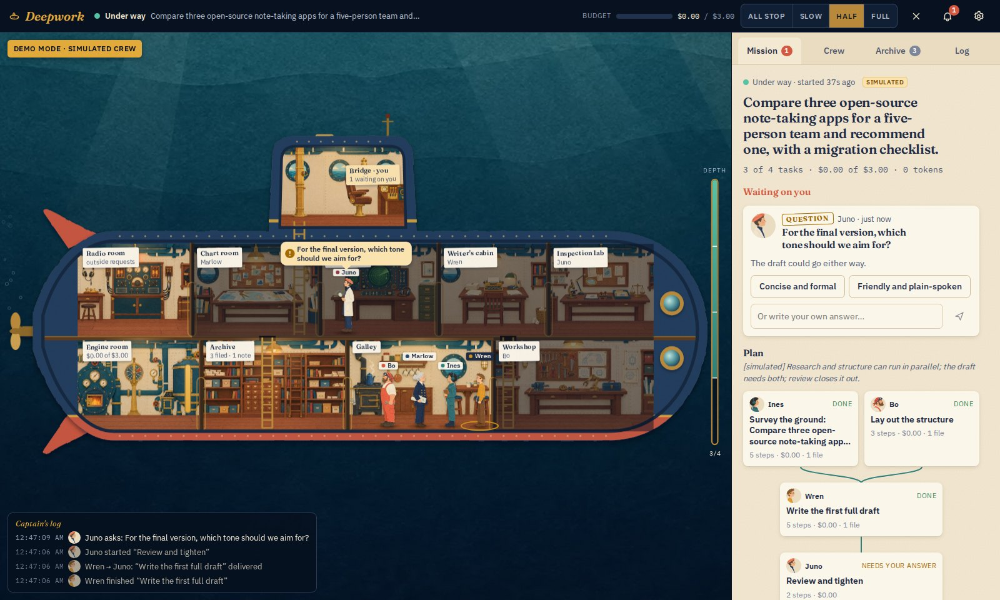
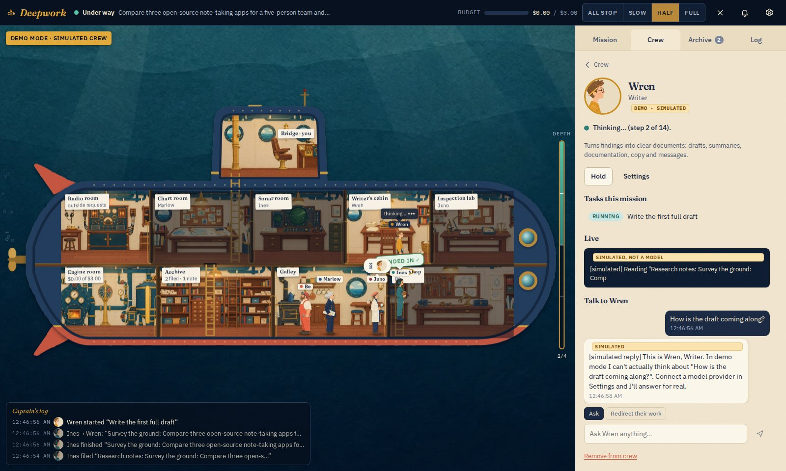
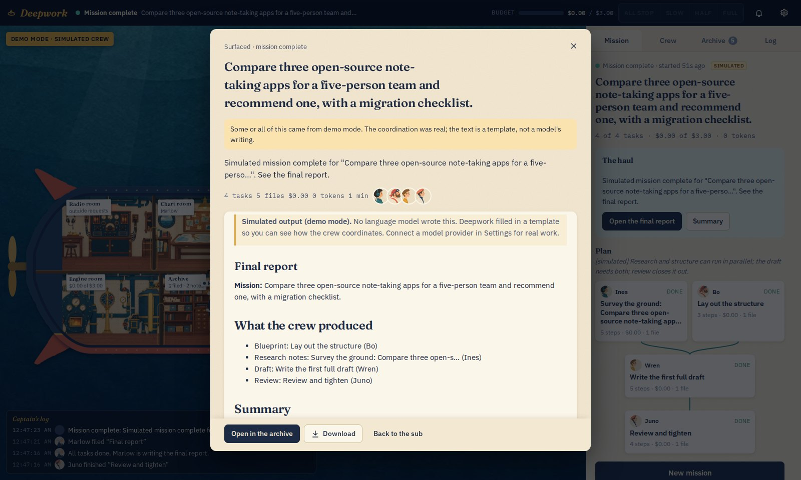

<p align="center">
  
</p>

<p align="center">
  <a href="https://github.com/0xNoramiya/deepwork/actions/workflows/ci.yml"></a>
  <a href="LICENSE"></a>
  
  <a href="CONTRIBUTING.md"></a>
</p>

Deepwork is a workspace for a team of AI agents, drawn as a paper-cut research submarine. You give the crew a goal. The lead splits it into tasks, the crew works in parallel where it can and waits on each other where it has to, and you step in when someone needs a decision. The work lands on disk as real files.

The submarine is a live view, not an animation loop. Where each crew member stands, what their speech bubble says, which rooms are lit and what travels down the pipes all come from the engine's current state.



## Features

- **Plan before anyone starts.** The lead proposes tasks as a dependency graph. Change owners, instructions or dependencies, then launch.
- **Parallel work, real dependencies.** Independent tasks run at the same time. When one finishes, its summary and files are handed to whoever needs them next.
- **Talk to any agent.** Ask a question without interrupting them, redirect their current task, put them on hold, or retry and skip tasks.
- **Approval for anything external.** Web requests wait in the radio room until you approve them, and you see the exact URL and body first.
- **Memory that carries over.** A project charter every agent reads, shared and personal notes with full-text search, and a record of past missions for the next plan to build on.
- **Bring your own models.** Anthropic, OpenAI, or any OpenAI-compatible endpoint. Each agent can use a different provider and model.
- **Guardrails on cost and loops.** Every mission has a budget and a token cap, every task has a step limit, and repeated identical calls get stopped.
- **Everything is inspectable.** Each model call, tool call, cost and reasoning summary is in the log and in the task's transcript.
- **Runs without keys.** Demo mode exercises the whole system with a scripted stand-in for the model, and labels every simulated word as such.

<table>
  <tr>
    <td width="50%"><br><sub>Review and edit the plan before launch.</sub></td>
    <td width="50%"><br><sub>An agent with a question comes to the bridge.</sub></td>
  </tr>
  <tr>
    <td width="50%"><br><sub>Watch an agent's output live, ask or redirect.</sub></td>
    <td width="50%"><br><sub>The final report, with every file the crew wrote.</sub></td>
  </tr>
</table>

<sub>Screenshots are from demo mode, which is why the output is marked simulated.</sub>

## Quick start

You need Node.js 20.19 or newer.

```bash
git clone https://github.com/0xNoramiya/deepwork.git
cd deepwork
npm install
npm run dev
```

Open http://localhost:5174. Without API keys the crew runs in demo mode. To use real models, export a key before starting:

```bash
export ANTHROPIC_API_KEY=sk-ant-...
npm run dev
```

or add one in the app under **Settings** (the gear icon). For a production build, run `npm run build && npm start`.

### Supported providers

| Provider | Environment variable |
| --- | --- |
| Anthropic | `ANTHROPIC_API_KEY` |
| OpenAI | `OPENAI_API_KEY` |
| OpenRouter | `OPENROUTER_API_KEY` |
| Google Gemini | `GEMINI_API_KEY` |
| Vercel AI Gateway | `AI_GATEWAY_API_KEY` |
| Groq, Mistral, DeepSeek, xAI | `GROQ_API_KEY`, `MISTRAL_API_KEY`, `DEEPSEEK_API_KEY`, `XAI_API_KEY` |
| Ollama, LM Studio, any OpenAI-compatible server | Added in Settings with a base URL |

The first provider with a key becomes the crew's default. You can switch the whole crew in Settings, or give each agent its own provider, model, effort level and tools in **Crew → Settings**.

## Meet the crew


| | Role | Station |
| --- | --- | --- |
| **Marlow** | Navigator and mission lead. Plans, coordinates and writes the final report. | Chart room |
| **Ines** | Researcher. Finds and checks information. | Sonar room |
| **Wren** | Writer. Turns findings into documents. | Writer's cabin |
| **Bo** | Engineer. Code, data, specs and prototypes. | Workshop |
| **Juno** | Inspector. Reviews work against the goal. | Inspection lab |

Everyone's role and instructions are editable, and you can hire more crew.

## Reading the submarine

| You see | It means |
| --- | --- |
| A lit room with its owner at the desk | Working. The caption above them is their current action, taken from the actual tool call. |
| Someone in the galley with faces in a thought bubble | Waiting for those teammates to finish work they depend on. |
| A brass capsule moving through the pipes | A handoff. Finished work is travelling to whoever needs it next. |
| Someone in the radio room with the red lamp on | An outside request waiting for your approval. |
| Someone on the bridge with an amber flag | A question for you. Click the flag to answer. |
| Two people talking | One agent consulting another. |
| The depth gauge on the right | Tasks done out of the total. |
| "ALL STOP" | The mission is paused. |

The engine-order telegraph in the top bar sets how many agents work at once. The Captain's log in the corner shows recent events, and the Log tab has everything.

## How it works

```
server/
  engine/orchestrator.ts   mission lifecycle, dependency scheduling, approvals, recovery
  engine/loop.ts           the agent tool loop, with budget, step and repeat guards
  engine/tools.ts          the tools agents can use and how each one is approved
  engine/prompts.ts        system prompts and task briefs, including handoffs and memory
  providers/               Anthropic and OpenAI-compatible adapters, plus the demo provider
  db.ts                    SQLite storage: crew, missions, transcripts, files, memory, events
src/
  world/                   the submarine: layout, movement, crew, rooms, effects
  panels/                  mission board, decisions, crew, archive, log, settings
```

A mission starts with the lead calling `submit_plan`. Plans are checked for unknown crew, missing dependencies and cycles, and problems go back to the lead to fix. The scheduler starts a task once its dependencies are done and its owner is free, up to the concurrency limit. Each agent works through a tool loop: writing and reading files, searching and saving memory, consulting a teammate, asking you, fetching a web page, and finally handing in. When every task is done, the lead writes the final report.

Every message is stored, so if the server restarts the mission comes back paused and each agent resumes where it stopped.

## Safety and cost

- **Approvals.** Reading a web page asks first unless you allow it for that agent. Sending an HTTP request always asks.
- **Network.** Agents can only reach the public internet. Private and internal addresses are refused, including through redirects and DNS rebinding, and fetched pages are passed to the model as untrusted data.
- **Budget.** The dollar and token limits are checked before every model call. At the limit the mission pauses and asks whether to add budget, wrap up or cancel.
- **Loops.** Step limits, repeated-call detection, and caps on consults, questions and replanning stop an agent from going in circles.
- **Keys.** Keys from environment variables are never stored. Keys entered in Settings are encrypted at rest with AES-256-GCM. Keys never reach the browser or the logs.
- **Local only.** The server listens on 127.0.0.1 and rejects cross-site and unexpected-host requests.

## Project status

Deepwork is early. The engine, scheduler, approvals, memory, persistence and UI are complete and covered by tests. The provider adapters are tested against local servers that speak the Anthropic and OpenAI streaming formats, but they have seen little use against live APIs so far. If a provider rejects a request, the error appears on the task card as the provider sent it.

Known limits:

- One mission runs at a time, for a single local user.
- Agents can write code but can't run it, and there is no web search, only fetching pages by URL.
- Saving a file under an existing name replaces it. The version number increases, but earlier versions aren't kept.
- Prices for non-Anthropic models are estimates. You can set exact prices per agent.

## Development

```bash
npm run dev         # server and UI with hot reload
npm test            # engine and provider tests
npm run typecheck
```

Data is stored in `data/` and files the crew writes go to `workspace/`. Delete both to start fresh. `DEEPWORK_DEMO_SPEED` scales demo pacing (`0` is instant).

## Contributing

Contributions are welcome. Read [CONTRIBUTING.md](CONTRIBUTING.md) to get set up, then open an issue or a pull request.

## License

[MIT](LICENSE)

## Acknowledgements

The illustrations were generated for this project with [Higgsfield](https://higgsfield.ai). The type is [Fraunces](https://github.com/undercasetype/Fraunces) and [IBM Plex](https://github.com/IBM/plex).
